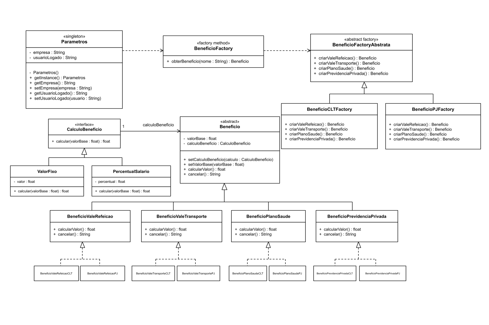

# Integração dos Padrões de Projeto: Singleton, Factory Method, Abstract Factory e Bridge

Projeto em Java exemplificando a integração dos padrões de projeto **Singleton**, **Factory Method**, **Abstract Factory** e **Bridge** no contexto de um sistema de benefícios de Recursos Humanos para a disciplina DCC078-2026.3-A - Aspectos Avançados em Engenharia de Software.

## Diagrama de Classes UML

## Padrões Utilizados

### Singleton

O padrão **Singleton** é utilizado na classe `Parametros`, responsável por armazenar informações compartilhadas do sistema, como a empresa e o usuário logado.

### Factory Method

O padrão **Factory Method** é utilizado pela classe `BeneficioFactory` para criar benefícios a partir do nome informado.

### Abstract Factory

O padrão **Abstract Factory** é utilizado pela interface `BeneficioFactoryAbstrata` e pelas fábricas `BeneficioCLTFactory` e `BeneficioPJFactory`, responsáveis pela criação das famílias de benefícios para funcionários CLT e PJ.

### Bridge

O padrão **Bridge** separa os benefícios das suas formas de cálculo. A classe abstrata `Beneficio` utiliza a interface `CalculoBeneficio`, que possui as implementações `ValorFixo` e `PercentualSalario`.

## Estrutura

- `Parametros`: classe Singleton que armazena parâmetros compartilhados do sistema.
- `BeneficioFactory`: Factory Method responsável pela criação dos benefícios.
- `BeneficioFactoryAbstrata`: interface da Abstract Factory.
- `BeneficioCLTFactory`: fábrica dos benefícios da família CLT.
- `BeneficioPJFactory`: fábrica dos benefícios da família PJ.
- `Beneficio`: abstração do Bridge para os benefícios.
- `CalculoBeneficio`: interface responsável pela implementação das formas de cálculo.
- `ValorFixo`: implementação de cálculo por valor fixo.
- `PercentualSalario`: implementação de cálculo por percentual do salário.
- `BeneficioValeRefeicao`, `BeneficioValeTransporte`, `BeneficioPlanoSaude` e `BeneficioPrevidenciaPrivada`: benefícios concretos.
- Classes `CLT` e `PJ`: produtos concretos das respectivas famílias de benefícios.

## Testes

Os testes verificam:

- funcionamento do Singleton;
- criação de benefícios pelo Factory Method;
- criação das famílias CLT e PJ pela Abstract Factory;
- funcionamento das implementações do Bridge;
- cálculo dos valores dos benefícios.